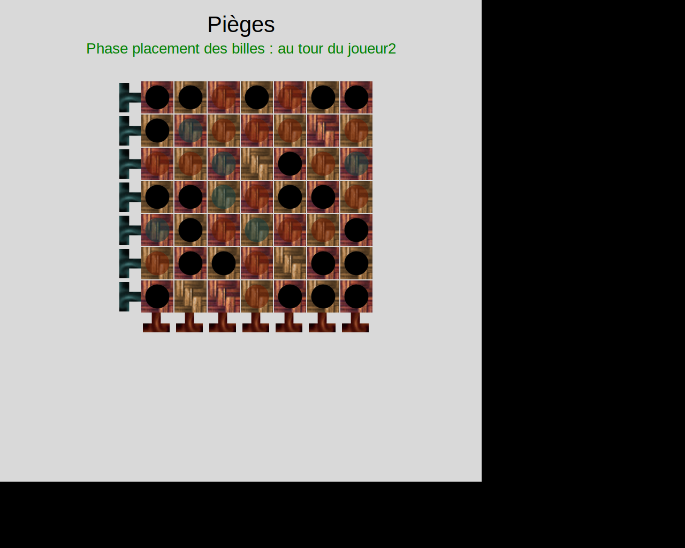
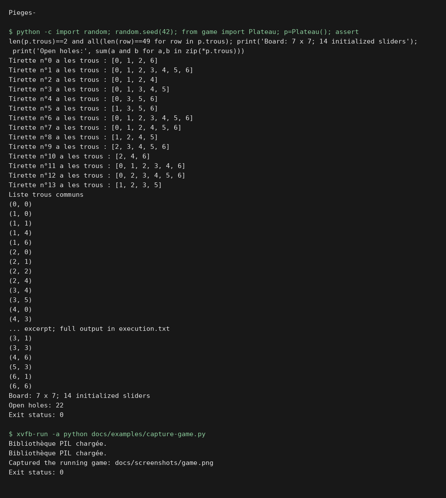

# Pièges ! (Stay Alive!)

Projet de jeu de stratégie multi-joueur « Pièges ! » (Stay Alive!)  
Développé en Python dans le cadre du TP/DM sur les interfaces texte et graphique.

<!-- execution-capture -->
## Execution preview





The actual seeded game board logic, followed by a headless start of the Tk interface. This checks rendering and board initialization, not a complete multiplayer match. [Verification](docs/verification.md).
<!-- /execution-capture -->

##  Objectif

- **V1 (Terminal)** : version solo, calcul de coups pour éliminer toutes les billes.
- **V2 (Graphique)** : version multi-joueur complète, interface graphique via le module FLTK.

##  Structure du dépôt

```
.
├── game.py                 # Moteur du jeu (structures et logique)
├── piege.py                # Interface graphique et boucle principale (FLTK)
├── fltk.py                 # Wrapper FLTK pour dessin et gestion d’événements
├── rapport Vincent Plessy Pieges!.pdf    # Rapport de projet détaillé
└── Sujet.pdf               # Énoncé du projet
```

## ⚙ Prérequis

- Python 3.8+
- tkinter (généralement fourni avec Python)
- PIL/Pillow (pour gestion avancée des images)

```bash
pip install pillow
```

##  Installation & Lancement

1. **Cloner** ou **télécharger** ce dépôt.
2. Installer les dépendances :

   ```bash
   pip install pillow
   ```

3. **V1 (Terminal)** :

   ```bash
   python3 game.py
   ```

   - Suit les invites textuelles pour placer et déplacer.
   - Compte le nombre de coups nécessaires.

4. **V2 (Graphique)** :

   ```bash
   python3 piege.py
   ```

   - Interface interactive dans une fenêtre FLTK.
   - Clic gauche pour tirer, clic droit pour pousser.
   - Dernier joueur à garder au moins une bille gagne.

##  Documentation & Rapport

Consultez **`rapport Vincent Plessy Pieges!.pdf`** pour :
- Règles détaillées
- Architecture du code
- Tests et résultats
- Améliorations possibles

## 🛠 Développement

- Le module **`fltk.py`** gère la création de la fenêtre, le dessin des formes et la gestion des événements (clics, touches).
- **`game.py`** définit :
  - `Plateau` : position des billes et des tirettes
  - `Tirette` : déplacement et gestion des trous
  - `Joueur`   : placement et gestion des billes
- **`piege.py`** orchestre le jeu (placement/phase tirettes) et crée l’interface utilisateur.

##  Contribution

Les modifications sont bienvenues !  
Forkez le dépôt, apportez vos améliorations et proposez une Pull Request.

##  Licence

Ce projet est libre, à adapter selon votre contexte (MIT, GPL, …).

---

**Auteur** : Vincent Plessy  
Étudiant L2 Informatique – Année 2024–2025
